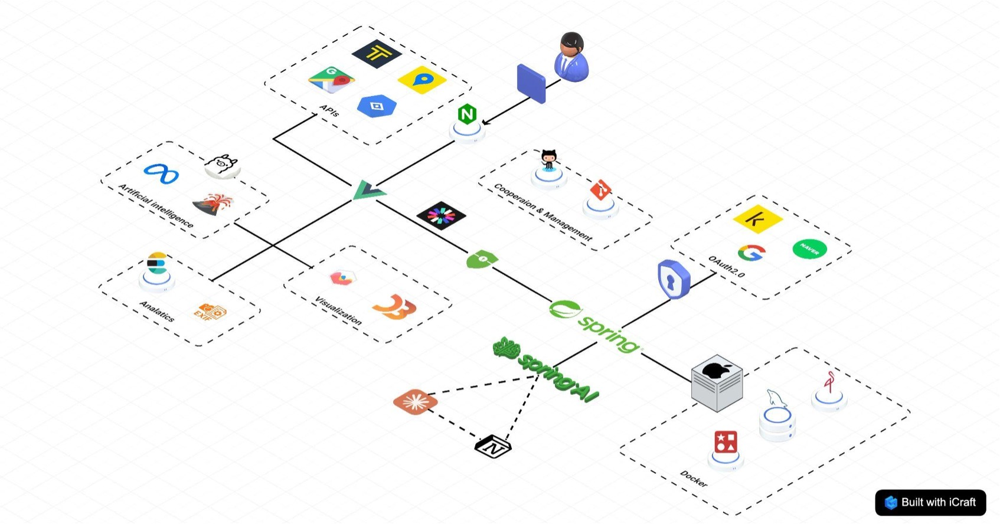
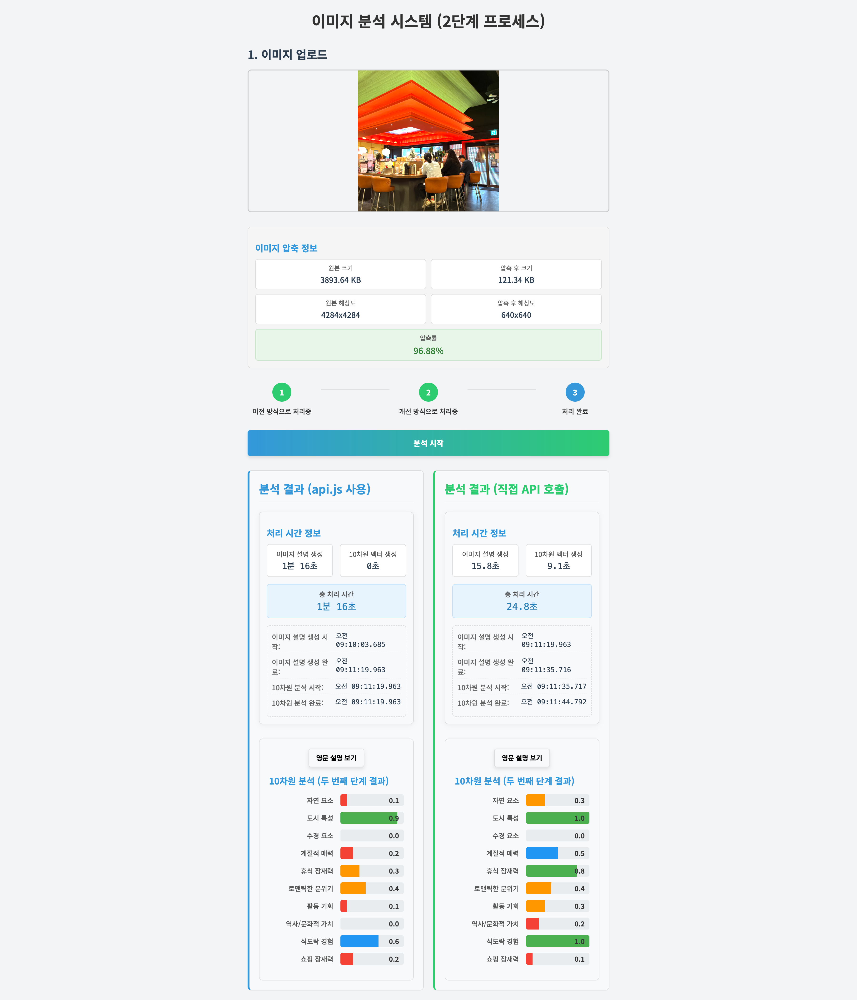

# LOG:O 🌍✨
**AI 기반 멀티모달 여행 검색 엔진 및 자동 가계부 서비스**

---

## ⚙️ 서비스 아키텍처 & 빠른 설정 가이드

<div align="center">

### 🏗️ **서비스 아키텍처**



*LOG:O의 전체 시스템 구조와 컴포넌트 간 연결*

---

### 📋 **[🚀 통합 설정 가이드 바로가기](./SETUP_GUIDE.md)**

[](./SETUP_GUIDE.md)

*전체 시스템 설치부터 실행까지 한 번에!*

</div>

---

## 🛠️ 기술 스택

#### Frontend


#### Backend & Framework


#### Database & Storage


#### Authentication & Security


#### AI & Backend


#### Infrastructure


---

## 🏗️ 기술 아키텍처

LOG:O는 마이크로서비스 아키텍처를 기반으로 하여 각 컴포넌트가 독립적으로 운영되면서도 유기적으로 연결된 시스템입니다.

## 🎯 프로젝트 개요

LOG:O는 **"감정과 분위기를 기반으로 여행지를 찾는"** 혁신적인 AI 여행 플랫폼입니다. 

### 💡 핵심 아이디어
> *"이런 분위기의 곳을 가고 싶어요"* 
> 
> 단순한 키워드 검색을 넘어서, 이미지 한 장으로 원하는 감성의 여행지를 찾아주는 AI 서비스

### 🎨 프로젝트 배경
- **기존 여행 검색의 한계**: 텍스트 기반 키워드 검색의 한계
- **감성 기반 니즈**: "힐링되는 곳", "로맨틱한 곳" 등 감정적 요구사항
- **여행 기록의 번거로움**: 수동적인 가계부 작성과 일정 관리
- **개인화 서비스 부족**: 획일적인 추천 시스템

---

## 📱 주요 서비스 소개

<div align="center">


*LOG:O의 핵심 기능들을 한눈에 확인하세요*

</div>

---

## 🚀 핵심 기능

### 🔍 **AI 멀티모달 검색**
- **이미지 분석**: Llava 모델로 이미지의 분위기와 특성 추출
- **10차원 벡터 검색**: 자연, 도시, 문화, 액티비티 등 세부 특성별 유사도
- **감정 키워드**: "로맨틱한", "힐링되는", "모험적인" 등 감성 기반 검색
- **하이브리드 검색**: 벡터 유사도 + 텍스트 매칭으로 정확도 극대화

### 🗺️ **스마트 여행 계획**
- **인터랙티브 지도**: D3.js 기반 직관적인 지역 선택 UI
- **최적 경로 계산**: 카카오 모빌리티 API로 효율적인 동선 계획
- **실시간 내비게이션**: 카카오맵 연동으로 정확한 길안내
- **예산 관리**: 카테고리별 지출 추적 및 실시간 통계

### 📱 **자동 가계부 / 방문 인증 시스템**
- **GPS 방문 인증**: 실제 위치에서만 인증 가능한 보안 시스템
- **OCR 영수증 인식**: Google Vision API + llama 3.2 한국어 양자화 모델 이중 처리
- **EXIF 메타데이터**: 사진의 시간/위치 정보로 정확한 기록
- **AI 키워드 분류**: 방문지에 대한 키워드와 설명을 AI를 활용해서 작성

### 💎 **개인화 서비스**
- **관심 장소 관리**: Vuex 기반 중앙화된 위시리스트
- **여행 히스토리**: 방문 기록 및 개인 리뷰 관리
- **통계 대시보드**: Chart.js 기반 여행 패턴 시각화 / 연령, 성별별 통계를 한눈에
- **맞춤형 추천**: 개인 취향 학습 기반 AI 추천
- **AI 여행 플래너**: 개인 성향별 AI 여행 계획 설계 및 문서화

---

## 🧠 AI 모델 상세

### 🎨 **Llava (이미지 분석)**
- **역할**: 업로드된 이미지 → 영문 Description 생성
- **특징**: 시각적 특성 인식 및 감정적 분위기 파악
- **출력**: JSON 형태의 구조화된 이미지 설명

### 🇰🇷 **Llama 3.2 Korean Bllossom (다국어 처리)**
- **역할**: 영문 → 한국어 번역, 10차원 벡터 임베딩 생성
- **모델**: 3B 파라미터 GGUF 양자화 모델 (Q4_K_M)
- **10차원 벡터 구성**:
  1. **Natural Elements** (자연 환경 요소 - 숲, 나무, 산, 야생동물, 꽃, 식물, 자연 지형 등)
  2. **Urban Character** (도시 및 도시 요소 - 건물, 고층 빌딩, 거리, 교통, 대중교통, 도시 공원, 도시 랜드마크 등)
  3. **Water Features** (물 관련 요소 - 폭포, 바다, 해변, 강, 호수, 연못, 개울, 온천, 분수대 등)
  4. **Seasonal Appeal** (계절적 특성 - 눈, 얼음, 가을 단풍, 봄 꽃, 여름 녹음, 겨울 서리, 계절 축제/장식 등)
  5. **Relaxation Potential** (휴식 가능성 - 편안한 시설, 휴식 공간, 조용한 장소, 스파, 온천, 명상 장소 등)
  6. **Romantic Atmosphere** (로맨틱한 분위기 - 커플을 위한 친밀한 공간, 일몰/일출 전망, 로맨틱한 조명 등)
  7. **Activity Opportunities** (활동 기회 - 하이킹 코스, 자전거 길, 수상 스포츠 시설, 등반 지역, 스키장, 모험 공원 등)
  8. **Historical/Cultural Value** (역사적/문화적 가치 - 역사 유적지, 유적, 궁전, 사원, 박물관, 문화 행사, 전통 건축물 등)
  9. **Food Experience** (음식 경험 - 레스토랑, 식품 시장, 길거리 음식, 카페, 요리 교실, 음식 축제 등)
  10. **Shopping Potential** (쇼핑 잠재력 - 시장, 상점, 부티크, 쇼핑 거리, 공예품 상점, 기념품 가게 등)

### 🔍 **ElasticSearch (하이브리드 검색)**
- **KNN 벡터 검색**: 코사인 유사도 기반 의미론적 검색
- **텍스트 검색**: Nori 형태소 분석기 기반 한국어 검색
- **하이브리드 스코어링**: 벡터 + 텍스트 점수 통합 랭킹

### 📋 **SpringAI & OpenAI (문서 자동화)**
- **여행 계획 자동 설립**: 사용자 Travel 데이터 기반 AI 추천 여행 계획 설립
- **문서 자동 기록**: 사용자 Notion Page에 여행 계획 문서화
- **문서 파일 추출**: .md(markdown)형식으로 여행 계획 파일화

</div>

## 📈 AI 모델 성능 개선 및 최적화

LOG:O 프로젝트에서는 사용자 경험 향상과 검색 정확도 개선을 위해 3가지 핵심 영역에서 성능 최적화를 진행했습니다.

### 🚀 **1. 이미지 벡터화 처리 방법 개선**

#### ⚠️ **기존 방식의 한계**
```
이미지 → Llama 3.2 Vision 11B → 10차원 벡터 (직접 변환)
```

**성능 지표:**
- **처리 시간**: 60-70초 (과도한 처리 시간)
- **API 호출**: 1번 (단일 호출)
- **벡터화 품질**: 불균일한 벡터 수치 생성
- **안정성**: 대용량 모델로 인한 메모리 부족 문제

#### ✅ **개선된 2단계 파이프라인**
```
이미지 → Llava 3B → 영문 설명 → Llama 3.2 3B → 10차원 벡터
```

**개선된 성능:**
- **처리 시간**: 20-30초 (약 **50-65% 성능 향상**)
- **API 호출**: 2번 (분리된 처리)
- **벡터화 품질**: 일관성 있는 벡터 수치 생성
- **안정성**: 경량 모델 조합으로 안정성 확보

<div align="center">



*이미지 벡터화 처리 방법 개선 전후 비교*

</div>

**핵심 개선사항:**
- ⚡ **처리 속도 2-3배 향상**: 대용량 모델 분리로 병렬 처리 가능
- 🎯 **벡터 품질 일관화**: 구조화된 영문 설명을 통한 정확한 벡터 생성
- 💾 **메모리 효율성**: 11B → 3B + 3B (총 6B, 45% 크기 감소)
- 🔄 **유지보수성**: 각 단계별 개별 최적화 및 모델 교체 가능

### 🎯 **2. Reverse Geolocation을 이용한 환각 효과 개선**

#### 📍 **문제 인식 및 해결 과정**

**기존 문제점:**
단순히 사진만 제공하는 경우, AI 모델이 정확한 위치 판단을 내리기 어려워 환각(Hallucination) 현상이 발생했습니다.

**기술적 해결 방안:**
```
방문 인증 시: GPS 좌표 수집 → Google Geolocation API → Reverse Geolocation → 상세 주소 정보 → AI 프롬프트 강화
```

**구현 세부사항:**
1. **GPS 좌표 활용**: 사용자의 정확한 위도/경도 실시간 수집
2. **Reverse Geolocation**: Google Geolocation API로 좌표를 상세 주소로 변환
3. **컨텍스트 프롬프트**: 지리적 위치 정보를 AI 모델 프롬프트에 포함
4. **정확도 검증**: 시각적 정보 + 지리적 정보 교차 검증

**개선 효과:**
- ✅ **환각 현상 최소화**: 정확한 위치 정보로 잘못된 AI 추론 방지
- ✅ **장소 특정성 향상**: 유사한 이미지의 서로 다른 장소 정확히 구분
- ✅ **키워드 정확도 개선**: 실제 방문 장소에 맞는 정확한 키워드 추출
- ✅ **사용자 신뢰도 증가**: 실제 방문 장소와 일치하는 AI 분석 결과

### 🔍 **3. ElasticSearch 한국어 키워드 토큰화 성능 개선**

#### 🇰🇷 **한국어 특화 분석기 개발**

**문제 인식:**
기존의 단순한 키워드 매칭 방식으로는 한국어 주소와 장소명의 다양한 표현을 효과적으로 처리할 수 없었습니다.

**커스텀 인덱스 구성:**
```json
PUT /store_index
{
  "settings": {
    "analysis": {
      "tokenizer": {
        "my_nori_tokenizer": {                    // 커스텀 한국어 토크나이저
          "type": "nori_tokenizer",
          "decompound_mode": "mixed",             // 복합어 분해 모드 (혼합)
          "discard_punctuation": true             // 구두점 제거
        }
      },
      "filter": {
        "my_pos_filter": {                        // 품사 필터링
          "type": "nori_part_of_speech",
          "stoptags": ["E", "J", "MAG", "MAJ", "MM", "SP", "XSN", "XSA", "XSV", "UNA"]  // 불필요한 품사 제거
        },
        "number_filter": {                        // 숫자만으로 구성된 토큰 제거
          "type": "pattern_replace",
          "pattern": "^\\d+$",
          "replacement": ""
        },
        "length_filter": {                        // 최소 길이 필터 (2글자 이상)
          "type": "length",
          "min": 2
        }
      },
      "analyzer": {
        "my_nori_analyzer": {                     // 커스텀 한국어 분석기
          "type": "custom",
          "tokenizer": "my_nori_tokenizer",       // 위에서 정의한 토크나이저 사용
          "filter": ["my_pos_filter", "number_filter", "length_filter"]  // 필터 체인 적용
        }
      }
    }
  }
}
```

**분석기 테스트 및 검증:**
```json
GET /store_index/_analyze
{
  "analyzer": "my_nori_analyzer",
  "text": "서울특별시 동작구 상도로 369 숭실대학교 중앙도서관"
}

// 결과: ["서울특별시", "동작구", "상도로", "숭실대학교", "중앙도서관"]
// → 의미 있는 토큰들로 정확히 분해됨
```

**핵심 기능 및 효과:**
1. **🔍 Nori 토크나이저**: 한국어 형태소 분석 최적화
2. **📝 품사 필터링**: 조사, 어미 등 불필요한 품사 제거로 노이즈 감소
3. **🔢 숫자 필터링**: 단순 숫자 토큰 제거로 검색 정확도 향상
4. **📏 길이 필터링**: 2글자 미만 토큰 제거로 검색 품질 개선

**성능 개선 결과:**
- 🔍 **검색 정확도 향상**: 의미 있는 키워드만 추출하여 검색 품질 대폭 개선
- 🌏 **지역 검색 다양성**: 다양한 표현 방식의 지역명과 주소 형태 인식 가능
- ⚡ **검색 속도 최적화**: 불필요한 토큰 제거로 인덱스 크기 감소 및 검색 속도 향상
- 📊 **한국어 특화**: 한국의 주소 체계와 지명 표기법에 최적화된 분석 시스템

### 📊 **전체 성능 개선 요약**

| 개선 영역 | 기존 방식 | 개선된 방식 | 성능 향상 |
|----------|----------|------------|----------|
| **이미지 처리** | 60-70초 (11B 모델) | 20-30초 (3B + 3B) | **50-65% 향상** |
| **위치 정확도** | 이미지만 사용 | GPS + Reverse Geo | **환각 현상 최소화** |
| **키워드 검색** | 단순 매칭 | Nori 토크나이저 | **검색 정확도 대폭 향상** |

### 이러한 3가지 핵심 개선을 통해 LOG:O는 더욱 정확하고 빠른 AI 기반 여행 검색 서비스를 제공할 수 있게 되었습니다. 
---

## 🎥 데모 시연

### 🔍 AI 이미지 검색 시연
*"이런 분위기의 여행지를 찾고 싶어요"*

https://github.com/user-attachments/assets/demo-search.mp4

### 📱 자동 가계부 시연
*영수증 촬영 → 자동 인식 → 즉시 가계부 입력*

https://github.com/user-attachments/assets/demo-receipt.mp4

### 🗺️ 스마트 여행 계획 시연
*드래그 앤 드롭으로 최적 경로 계획*

https://github.com/user-attachments/assets/demo-planning.mp4

---

## 🌟 비즈니스 모델 및 향후 계획

### 💼 **수익 모델**
1. **프리미엄 구독**: 고급 AI 분석 및 무제한 검색
2. **여행사 파트너십**: 추천 여행지 예약 수수료
3. **광고 플랫폼**: 타겟팅된 여행 상품 광고
4. **데이터 인사이트**: 익명화된 여행 트렌드 분석 서비스

### 📅 **2025년 로드맵**

#### 상반기 (Q1-Q2)
- [ ] **모바일 앱 출시** (React Native)
- [ ] **소셜 기능 추가** (여행 공유, 친구 추천)
- [ ] **AI 추천 고도화** (개인화 알고리즘 강화)
- [ ] **다국어 지원** (영어, 중국어, 일본어)

#### 하반기 (Q3-Q4)
- [ ] **AR 여행 가이드** (실시간 장소 정보 오버레이)
- [ ] **블록체인 마일리지** (여행 토큰 이코노미)
- [ ] **여행사 통합 예약** (항공, 숙박, 액티비티)
- [ ] **IoT 연동** (스마트워치, 웨어러블 디바이스)

---

## 🔧 개발 환경 및 설치

### 📋 **시스템 요구사항**
- **OS**: Windows 10+, macOS 10.15+, Ubuntu 18.04+
- **메모리**: 최소 8GB RAM (16GB 권장)
- **저장공간**: 20GB 이상
- **네트워크**: 안정적인 인터넷 (모델 다운로드용)

### 🚀 **빠른 설치**
1. **필수 소프트웨어**: Docker Desktop, Node.js 18+, Git
2. **설정 가이드**: [SETUP_GUIDE.md](./SETUP_GUIDE.md) 참조
3. **실행 순서**: ElasticSearch → Ollama → Vue.js

```bash
# 1. ElasticSearch 실행
cd LOG-O-ELK && docker-compose up -d

# 2. Ollama 모델 생성
cd LOG-O-Ollama && ollama create light_2 -f light_3.Modelfile

# 3. Vue.js 개발 서버
cd LOG-O-vue && npm install && npm run serve
```

---

## 🤝 기여 및 협업

### 📬 **연락처**
- **이슈 제기**: [GitHub Issues](https://github.com/yourusername/LOG-O/issues)
- **기능 요청**: [Feature Request](https://github.com/yourusername/LOG-O/discussions)
- **보안 취약점**: security@logo-project.com

### 💡 **기여 방법**
1. Repository Fork
2. Feature Branch 생성 (`git checkout -b feature/amazing-feature`)
3. 변경사항 커밋 (`git commit -m 'Add amazing feature'`)
4. Branch Push (`git push origin feature/amazing-feature`)
5. Pull Request 생성

---

## 📄 라이선스 및 법적 고지

이 프로젝트는 **MIT 라이선스** 하에 있습니다. 자세한 내용은 [LICENSE](LICENSE) 파일을 참조하세요.

### 🏛️ **오픈소스 라이선스**
- Vue.js: MIT License
- ElasticSearch: Elastic License 2.0
- Ollama: MIT License
- D3.js: BSD 3-Clause License

---

## 👨‍💻 개발팀

<div align="center">

|                                                          **박병찬**                                                          |                                                          **한승수**                                                          |
| :--------------------------------------------------------------------------------------------------------------------------: | :--------------------------------------------------------------------------------------------------------------------------: |
| [ <br/> @qudcks8084](https://github.com/qudcks8084) | [ <br/> @SEUNGSU-HAN](https://github.com/SEUNGSU-HAN) |
|                                                    **Frontend · ElasticStack · AI**                                                    |                                                    **Backend · Database · Infrastructure**                                                    |

### 📊 **박병찬 (팀장)** - *Frontend & AI Specialist*
- **Vue.js 3 + Vuex**: 컴포넌트 설계 및 상태 관리
- **D3.js**: 인터랙티브 데이터 시각화 구현
- **ElasticSearch**: 벡터 검색 및 한국어 분석 최적화
- **Ollama AI**: 커스텀 모델 생성 및 파인튜닝
- **카카오맵/구글 API**: 지도 서비스 통합 개발

### 🏗️ **한승수 (부팀장)** - *Backend & Infrastructure*
- **Spring Boot**: RESTful API 설계 및 구현
- **MySQL**: 데이터베이스 스키마 설계 및 최적화
- **Docker**: 컨테이너 기반 인프라 구축
- **서버 운영**: 배포 자동화 및 모니터링
- **성능 최적화**: 데이터베이스 쿼리 및 시스템 튜닝

### 📞 **연락처**
- **박병찬**: 📧 qudcks8084@gmail.com | 🐙 [@qudcks8084](https://github.com/qudcks8084)
- **한승수**: 📧 h2sorginal@gmail.com | 🐙 [@SEUNGSU-HAN](https://github.com/SEUNGSU-HAN)

</div>

---

<div align="center">

**LOG:O** - AI와 함께하는 스마트한 여행 경험 🌍✨

*여행의 모든 순간을 더 특별하게*

[](https://github.com/yourusername/LOG-O)
[](https://github.com/yourusername/LOG-O/fork)
[](https://github.com/yourusername/LOG-O/issues)

---


**LOG:O** © 2025. All rights reserved.

